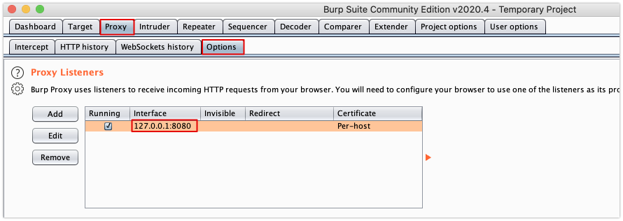
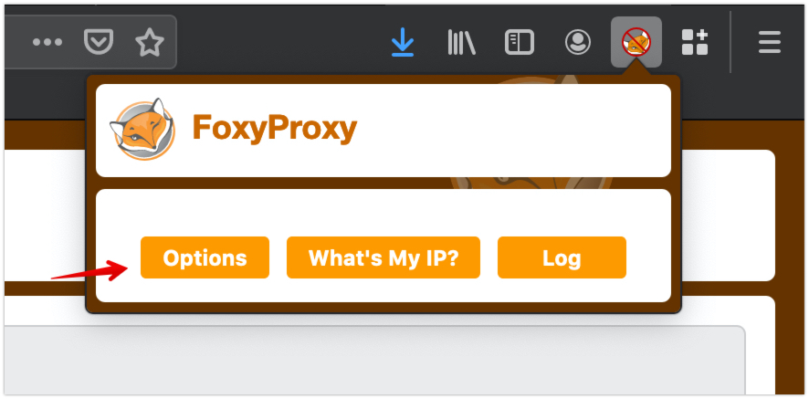
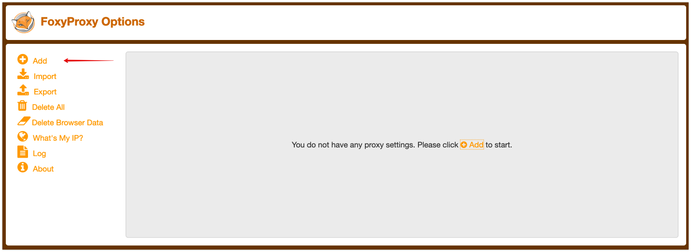
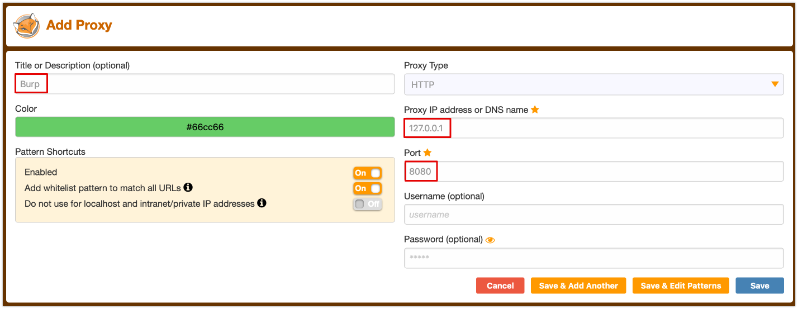
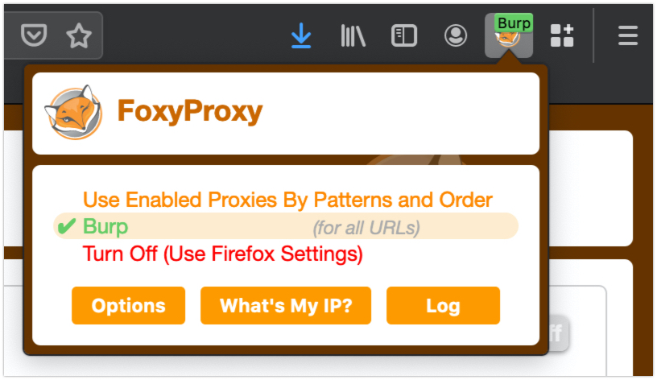

# Summer of Tech Aura Hacking Challenge Setup Guide

## Setting up Burp Suite

Burp Suite is a great tool for web security testing. While it is optional for the Summer of Tech workshop, it is very worthwhile to learn if you want to delve deeper into the world of web security testing. 

### Download and Install Burpsuite

Download Community Edition of Burp Suite here for the platform you are using (Windowx/MacOS): https://portswigger.net/burp/communitydownload

Complete the setup process and open Burp Suite. 

Select 'Temporary Project', click next. Select 'Use Burp Defaults' in the next screen. 

Go to the Proxy tab, then Options, and note down the Proxy Listeners for our next step.

### Setup Proxy from Browser
One of the main features for Burp Suite is the web proxy which can intercept the request between your browser to the server. When you visit Google, your browser (the client) sends an HTTP request to the Google web server which is basically asking "Hey can I please have www.google.com?". The server them sends the response which is the HTML content of the website, which your browser can then display as the webpage on your computer screen. What Burp Suite is able to do is to act as a middle man and it stands between your browser and the web server, so you could manually modify the request after it is sent from the browser. 

Therefore, we need to set up the proxy settings in the browser so the browser knows to redirect the request to Burp Suite so we can modify the requests in Burp Suite. A good way to do this is by using the `FoxyProxy` add-on: [Firefox](https://addons.mozilla.org/en-US/firefox/addon/foxyproxy-standard/) or [Chrome](https://chrome.google.com/webstore/detail/foxyproxy-standard/gcknhkkoolaabfmlnjonogaaifnjlfnp?hl=en). 

1. Go to Options 

2. Add new proxy

3. Put in the following settings:

Title: `Burp`\
Proxy IP Address: `127.0.0.1`\
Port: `8080`

Press Save

4. Now select the Burp Proxy profile

### Install Burp Certificate

We need to install the Burp Suite certificate in the browser. 

1. Download the CA Certificate by going to http://burp/ in the browser that is set up with Burp proxy. Select the `CA Certificate` button. 

2. Save the certificate. In your browser, add the certificate as a certificate authority in the settings. This will differ by browser and there are detailed documentations on how to do that for specific browsers here: https://portswigger.net/support/installing-burp-suites-ca-certificate-in-your-browser. 

Feel free to get in touch with us on Slack if there are any questions! 
